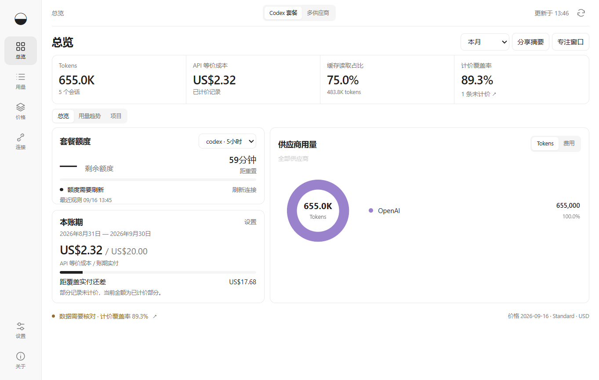

# Subscription Lens

A Windows desktop app for **Codex subscription users** who want to see their remaining quota, understand which projects use their tokens, and compare recorded usage at API rates with their subscription payment. No API key is required.

[English](README.md) · [简体中文](docs/README.zh-CN.md) · [Nederlands](docs/README.nl.md)

## What you can do

| Task | Features |
| --- | --- |
| Check remaining capacity | Account quota, reset countdowns and recent-pace estimates when enough observations are available. |
| Understand your usage | Browse recorded tokens by project, model and session; drill down to individual records. |
| Compare usage with your payment | View estimated API-equivalent costs alongside your actual payment for the billing period. |
| Keep limits within reach | Use a compact pinnable window, the system tray and optional low-quota alerts with quiet hours. |
| Export and share | Export records to CSV or save an aggregate-only HTML report without project names or account identifiers. |



*Overview with synthetic data; no real account or conversation data is shown.*

## Download and get started

**1.2.0 Preview · Windows x64.** The current collector does not yet handle all Codex record formats; totals may be too high or too low. Costs are estimates, not a bill or guaranteed savings. The build is unsigned and has no automatic updater.

[Download the installer or portable ZIP](https://github.com/zh3nggg/subscription-lens/releases/tag/v1.2.0)

1. Select **Start monitoring** to read the default Codex folder, or **Choose folder** for a custom folder containing `sessions` or `archived_sessions`.
2. Open **Connections → Connect account** to query limits through your locally installed Codex. If signed out, use **Sign in to ChatGPT**.
3. Under **Settings**, enter your billing dates, plan payment and extra credit payments in USD. The end date is exclusive. Choose manual dates or automatic monthly renewal.
4. Choose **Language**: system default, Simplified Chinese, English or Dutch, then **Save**. The choice takes effect immediately and is preserved after restart. Other system languages default to English.

No API key, Node.js, Python or Docker is needed to run the app. Account queries require an installed Codex executable; local usage monitoring works without an account connection.

<details>
<summary>Usage details and shortcuts</summary>

- **Know when to slow down.** The overview prioritizes account capacity and reset time. Recent-pace estimates require at least three observations, 15 minutes and a measurable change in the same account/window/reset. They use up to two hours of observations, never local token-to-quota guesses. Stale data (over three minutes), resets and counter corrections suppress unreliable estimates. Forecasts assume your recent pace continues; they are not guarantees.
- **Stay in your work.** Open Compact view with Ctrl+Shift+M; optionally pin it above other windows. Escape restores the dashboard. A tray click opens this view when tray mode is enabled.
- **Get quiet alerts.** Opt into alerts at 20% and 5% remaining and observed quota recovery. Alerts are deduplicated per window and account. Quiet hours default to 22:00–08:00 local time. The app must remain running; Windows notification settings can suppress delivery.
- **Find expensive work.** Select a project or chart date, sort sessions by cost or recency, then inspect the exact records. Ctrl+K opens search. Session totals count each record once; subagent rows show their own usage, not an inclusive parent total.
- **Keep billing current.** Choose Monthly renewal and your renewal day. Short months clamp to their last day without changing the anchor. Plan payment repeats; extra payments apply only to the current cycle. Existing installations keep manual dates until you change the mode.
- **Check the evidence.** Data health shows unpriced reasons, parsing issues and price snapshot date, with direct links to affected records and sources. Pricing coverage does not prove complete account history. Previous-period comparisons use the immediately preceding interval of equal elapsed length, not a calendar-month forecast.
- **Share without revealing projects.** Preview and export a self-contained HTML summary. It includes totals, pricing coverage and date range, but no account identity, project names, paths or session IDs. Nothing is uploaded automatically.

Quota observations are stored locally for up to three days, capped at 25,000 rows. No new runtime dependencies, cloud service or model calls were added for these features.

</details>

## Data and estimates

The app reads Codex records without changing them. It stores usage metadata, including project names, but not chat bodies. Authentication is managed by Codex; the app does not ask you to paste cookies or tokens.

Data is saved in `%APPDATA%\Subscription Lens`. Uninstalling retains data by default. The portable ZIP uses the same user data location. Set `LENS_DATA_DIR` for a custom location. Do not share a live database between devices.

The bundled prices are the **2026-09-16 Standard USD snapshot**. These rates are applied to collected history, not historical prices at each event's time. Fast/Batch, regional surcharges and tool fees are not included. Unknown models or incomplete pricing remain unpriced. Updating the catalog recalculates existing records.

API-equivalent cost is an estimate, not a bill or guaranteed savings. Enter your actual payment to compare. Incomplete collection can understate the total value.

Local records and account summaries are shown separately, never added together. Regular ChatGPT chats are not supported. Other devices and cloud task details are not collected automatically. Historical local records are not automatically attributed to the currently connected account; select only your own folders on shared computers.

## Current scope and roadmap

Currently supports Codex/OpenAI on Windows. Regular ChatGPT conversations, other providers and usage on other devices are not collected automatically. Full Codex feature parity with CodexBar and codex-usage is not complete.

The next update prioritizes integration of the tested codex-usage engine and safe migration, followed by task trees, agent attribution and hourly analysis. Optional Claude, Cursor, Gemini and other provider support is on the roadmap; no delivery date is committed.

[Roadmap](ROADMAP.md) · [Coverage checklist](docs/COMPATIBILITY.md) · [Release boundaries](docs/RELEASE.md) · [Validation](docs/VALIDATION.md)

## Build and contribute

Use Windows x64 and Node.js 24. Dependencies are pinned in package-lock.json. See [CONTRIBUTING.md](CONTRIBUTING.md) for synthetic UI tests, translation changes and the experimental native engine. The real-account smoke test is manual-only.

```powershell
npm ci
npm test
npm start
npm run dist
```

## Development and acknowledgements

Developed with assistance from **GPT-6 Astra**.

[CodexBar](https://github.com/steipete/CodexBar) informs the quota and desktop interaction requirements. MIT-licensed [codex-usage](https://github.com/zJay26/codex-usage) source is included for the next accounting-engine integration; it is not active in the 1.2.0 desktop app.

MIT. See [third-party notices](THIRD-PARTY-NOTICES.md) for attribution and licenses. This is an independent project, not affiliated with OpenAI or endorsed by the referenced projects.
