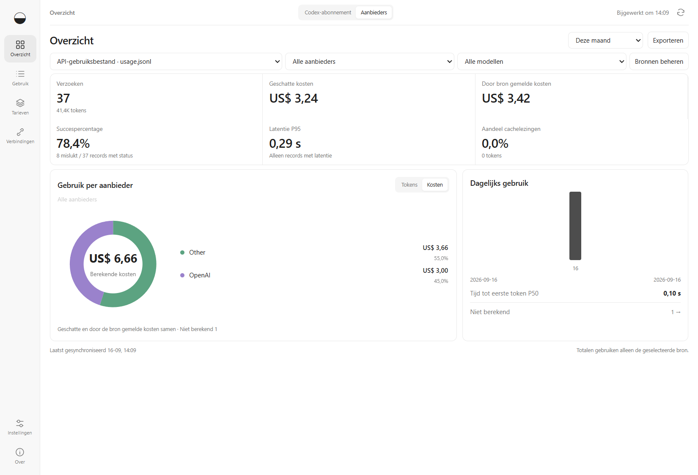

# Subscription Lens

Een Windows-desktopapp voor **Codex-abonnees** die hun resterende limieten willen bekijken, willen zien welke projecten tokens gebruiken en een modelmix willen kiezen die de limiet tot de volgende reset laat meegaan. De app vergelijkt ook vastgelegd gebruik tegen API-tarieven met de abonnementsbetaling. Geen API-sleutel nodig.

[English](../README.md) · [简体中文](README.zh-CN.md) · [Nederlands](README.nl.md)

## Wat kun je ermee?

| Behoefte | Functies |
| --- | --- |
| Resterende capaciteit bekijken | Accountlimieten, aftellen tot herstel en temposchattingen zodra voldoende metingen beschikbaar zijn. |
| Tokengebruik begrijpen | Gebruik per project, model en sessie bekijken en doorklikken naar afzonderlijke records. |
| Je modelmix plannen | Maak van de modelhistorie en het gemiddelde tempo in het actieve quotavenster een aanbevolen mix voor de volgende reset, met betrouwbaarheid en bijsturing per model. |
| Gebruik met je betaling vergelijken | Geschatte equivalente API-kosten naast je werkelijke betaling per factuurperiode bekijken. |
| Limieten tijdens het werk volgen | Een compact vastzetbaar venster, systeemvak en optionele limietmeldingen met stille uren. |
| Apparaten privé vergelijken | Koppel lokale Codex-records aan een stabiel apparaat, filter per apparaat en wissel anonieme pakketten uit zonder chatinhoud of paden. |
| Exporteren en delen | Records naar CSV exporteren of een HTML-overzicht opslaan zonder projectnamen of accountidentificaties. |

## Aanbieders volgen in 1.4

Verbind Qwen Code, Kimi Code, CodeBuddy Code, Qoder, CC Switch, Claude Code, Gemini CLI of je eigen API-gebruiksbestand. Op Windows leest Qoder Quest lokale IDE-agentlogs met contextsnapshots; deze Tokens worden duidelijk als schatting gemarkeerd. Qoder-streams kunnen ook met het ingebouwde script worden vastgelegd; Credits blijven gescheiden van API-equivalent USD en cumulatieve resultaten worden overgeslagen om dubbele kosten te voorkomen. Chinese modelfamilies worden in hetzelfde diagram toegewezen aan Alibaba Cloud, Moonshot AI, Zhipu AI, MiniMax en DeepSeek. [Bronnen en kostendefinities](PROVIDER-MONITORING.md).

De diagrammen per aanbieder en model tonen ook de gemiddelde kosten per 1M tokens voor de geselecteerde periode. Alleen tokens met een prijs vormen de noemer; ongeprijsd gebruik blijft zichtbaar maar telt niet mee in het gemiddelde.

Geïnstalleerde tools in standaardmappen worden automatisch gevonden en kunnen samen worden verbonden; aangepaste locaties blijven beschikbaar. Het Codex-overzicht adviseert een modelmix op basis van de modelhistorie en het gemiddelde quotatempo in het actieve venster. Omdat OpenAI geen exacte quotagewichten per model publiceert, toont het advies de betrouwbaarheid en blijft het zichzelf kalibreren.



*Het overzicht toont synthetische gegevens, geen echte account- of gespreksgegevens.*

## Downloaden en aan de slag

**1.4.5 Stable · Windows x64.** De collector verwerkt nog niet alle recordformaten volledig; totalen kunnen te hoog of te laag zijn. Kosten zijn schattingen, geen factuur of gegarandeerde besparing. Deze build is niet digitaal ondertekend en heeft geen automatische updates.

[Download 1.4.5](https://github.com/zh3nggg/subscription-lens/releases/tag/v1.4.5)

Gebruik `Subscription-Lens-1.4.5-x64.exe` voor een eerste installatie of upgrade. Sluit Subscription Lens, start het installatiebestand en behoud bij een upgrade de bestaande installatiemap (bijvoorbeeld `D:\SubLens`). Het vervangt de oude app met behoud van instellingen en lokaal gebruik. Kies de draagbare ZIP alleen voor een losse versie zonder installatie: pak die uit in een eigen map en start `Subscription Lens.exe`; de ZIP werkt een geïnstalleerde app niet bij.

1. Kies **Monitoring starten** voor de standaardmap van Codex, of **Map kiezen** voor een eigen map met `sessions` of `archived_sessions`.
2. Open **Verbindingen → Account verbinden** om limieten op te halen via de lokaal geïnstalleerde Codex. Gebruik **Aanmelden bij ChatGPT** als je nog niet bent aangemeld.
3. Vul onder **Instellingen** de factuurperiode, abonnementsbetaling en betaling voor extra tegoed in USD in. De einddatum telt niet mee. Kies handmatige datums of automatische maandelijkse verlenging.
4. Kies bij **Taal** de systeeminstelling, vereenvoudigd Chinees, Engels of Nederlands en klik op **Opslaan**. De keuze wordt direct toegepast en blijft na een herstart behouden. Bij andere systeemtalen wordt Engels gebruikt.

De hoofdwerkruimte is volledig bruikbaar vanaf 760×560. De eerste Codex-weergave combineert abonnementsstatus, periodevergelijking en verdeling per aanbieder/model. Middelgrote vensters gebruiken tabbladen voor trends en projecten; hoge vensters tonen automatisch meer, met behoud van bron en periode.

Je hebt geen API-sleutel, Node.js, Python of Docker nodig. Voor accountgegevens moet Codex geïnstalleerd zijn. Lokaal gebruik bijhouden werkt ook zonder accountverbinding.

<details>
<summary>Gebruiksdetails en sneltoetsen</summary>

- **Vooraf capaciteit bekijken.** Het overzicht toont resterende limieten en de tijd tot herstel. Een quotaschatting vereist minstens drie metingen, 15 minuten en een meetbare verandering binnen hetzelfde account, venster en herstelmoment. Alle bewaarde metingen in het actieve quotavenster worden gebruikt, zodat het gemiddelde het volledige venster omvat in plaats van alleen de laatste twee uur. Gegevens ouder dan drie minuten, resets en tellercorrecties onderdrukken onbetrouwbare schattingen. Een schatting gaat uit van het gemiddelde tempo van dit venster en is geen garantie. Lokale tokens worden nooit naar abonnementslimieten omgerekend.
- **Tijdens het werk compact blijven.** Ctrl+Shift+M opent het compacte venster, dat je optioneel kunt vastzetten. Escape herstelt het overzicht. Een klik op het systeemvakpictogram opent het compacte venster als systeemvakmodus actief is.
- **Gerichte meldingen.** Schakel meldingen in bij 20% en 5% resterend en bij gemeten herstel. Meldingen worden per account en venster ontdubbeld. Stille uren zijn standaard 22:00–08:00 lokale tijd. Laat de app actief; Windows kan meldingen onderdrukken.
- **Duur werk terugvinden.** Selecteer een project of grafiekdatum, sorteer sessies op kosten of recente activiteit en bekijk de exacte records. Ctrl+K opent zoeken. Subagents tonen alleen hun eigen gebruik; kosten worden niet dubbel in een oudersessie opgeteld.
- **Automatisch verlengen.** Kies een maandelijkse verlengdag. Kortere maanden gebruiken de laatste dag zonder de vaste verlengdag te wijzigen. De abonnementsbetaling herhaalt zich; extra betalingen gelden alleen voor de huidige periode. Bestaande installaties behouden eerst handmatige datums.
- **Gegevens controleren.** Bekijk ontbrekende tarieven, verwerkingsfouten en de tariefdatum met directe links naar records en bronnen. Tariefdekking bewijst niet dat de accountgeschiedenis volledig is. Vergelijkingen gebruiken het direct voorafgaande tijdvak van gelijke duur.
- **Zonder projectgegevens delen.** Bekijk een voorbeeld en exporteer een zelfstandig HTML-overzicht met totalen, tariefdekking en datumbereik. Geen account, projectnamen, paden of sessie-ID’s; er wordt niets automatisch geüpload.

Limietmetingen blijven bewaard zolang het bijbehorende quotavenster actief is en nog twee dagen daarna, met een grens van 25.000 records. Geen nieuwe runtime-afhankelijkheden, clouddienst of modelaanroepen.

</details>

## Gegevens en schattingen

De app leest Codex-records zonder ze te wijzigen. Gebruiksmetadata, waaronder projectnamen, worden opgeslagen; gespreksinhoud wordt niet opgeslagen. Codex beheert de aanmelding. Je hoeft geen cookies of tokens te plakken.

Gegevens staan in `%APPDATA%\Subscription Lens` en blijven standaard behouden na het verwijderen van de app. De ZIP-versie gebruikt dezelfde gegevensmap. Stel `LENS_DATA_DIR` in voor een andere locatie. Deel een actieve database niet tussen apparaten.

De meegeleverde tarieven zijn een **momentopname van Standard-tarieven in USD op 2026-09-16**. Ze worden toegepast op het verzamelde historische gebruik; het zijn geen historische tarieven per gebeurtenis. Fast/Batch, regionale toeslagen en toolkosten zijn niet inbegrepen. Onbekende modellen of onvolledige tarieven blijven onberekend. Bij het bijwerken van de tarieven worden bestaande records opnieuw berekend.

Equivalente API-kosten zijn een schatting, geen factuur of gegarandeerde besparing. Vul je werkelijke betaling in om te vergelijken. Ontbrekende gegevens kunnen de geschatte waarde verlagen.

Lokale records en accounttotalen worden apart getoond en nooit bij elkaar opgeteld. Gewone ChatGPT-gesprekken worden niet ondersteund. Andere apparaten en details van cloudtaken worden niet automatisch ingelezen. Historische lokale records worden niet automatisch aan het verbonden account toegewezen; selecteer op gedeelde computers alleen je eigen mappen.

## Huidige scope en volgende update

Ondersteunt Codex-abonnementen en lokale records van meerdere aanbieders op Windows. Gewone ChatGPT-gesprekken en gebruik op andere apparaten worden niet automatisch ingelezen. Volledige Codex-functionaliteit van CodexBar en codex-usage is nog niet bereikt.

Versie 1.4 voegt read-only connectors voor Qwen Code, Kimi Code en CodeBuddy Code toe, plus herkenning van GLM-, Qwen-, Kimi-, MiniMax- en DeepSeek-modellen via Claude Code, CC Switch of compatibele gateways. Oudere formaten en quota- of creditinterfaces blijven op de [acceptatieroadmap](DOMESTIC-COMPATIBILITY.md).

[Roadmap](../ROADMAP.md#nederlands) · [Dekking](COMPATIBILITY.md) · [Releasegrenzen](RELEASE.md) · [Validatie](VALIDATION.md)

## Zelf bouwen en bijdragen

Gebruik Windows x64 en Node.js 24. Afhankelijkheden zijn vastgelegd in package-lock.json. Zie [CONTRIBUTING.md](../CONTRIBUTING.md) voor synthetische interfacetests, vertalingen en de experimentele engine. De test met een echt account is uitsluitend voor handmatig gebruik.

```powershell
npm ci
npm test
npm start
npm run dist
```

## Ontwikkeling en dankwoord

Ontwikkeld met ondersteuning van **GPT-6 Astra**.

[CodexBar](https://github.com/steipete/CodexBar) dient als referentie voor limieten en desktopinteractie. MIT-gelicentieerde broncode van [codex-usage](https://github.com/zJay26/codex-usage) is opgenomen voor de volgende engine-integratie; deze is nog niet actief in de desktopapp 1.4.5.

MIT. Zie [licenties van derden](../THIRD-PARTY-NOTICES.md) voor bronnen en auteursrechten. Dit is een onafhankelijk project, niet verbonden aan OpenAI of onderschreven door de genoemde projecten.
