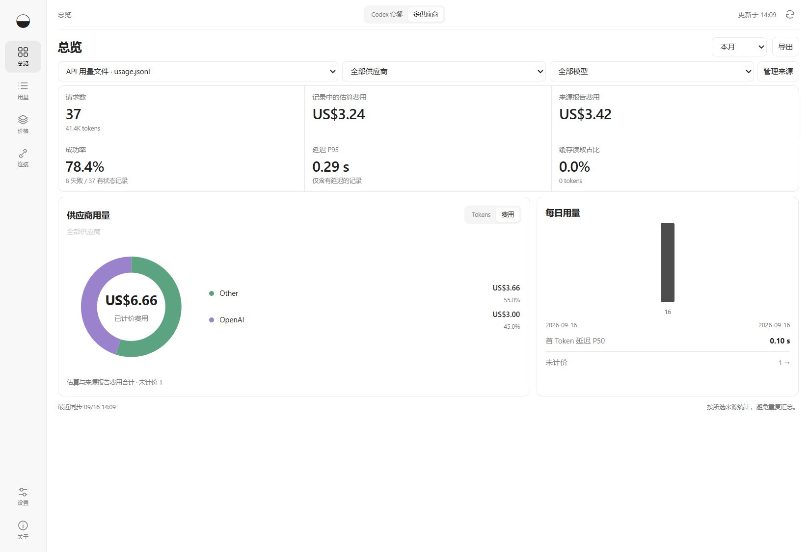

# 余量 · Subscription Lens

面向 **Codex 套餐用户**的 Windows 桌面应用：查看还剩多少额度、哪些项目消耗了 Tokens，并推荐一套能将额度用到下次重置前的模型使用配比；同时比较已记录用量按 API 价格估算后与套餐实付的差额。无需 API Key。

[English](../README.md) · [简体中文](README.zh-CN.md) · [Nederlands](README.nl.md)

> **3.0 代际预览版。** `3.0.0-beta.1` 是从 1.6.x 稳定版本线跳到的新一代版本。此前公开版本使用 Electron 桌面应用；本版本继续沿用 Electron 界面，并把兼容 CC Switch 的路由运行时直接打包进应用。这不是从 Tauri 迁移而来的版本。测试预览版时请保留 1.6.5 作为回退版本。

## 主要功能

| 使用需求 | 对应功能 |
| --- | --- |
| 了解还能用多久 | 查看账户额度、重置倒计时；观测充足时提供基于近期使用速度的估算。 |
| 弄清 Tokens 用在哪里 | 按项目、模型和会话查看已记录用量，逐层进入具体记录。 |
| 规划模型使用配比 | 根据当前额度窗口的模型历史和平均速度，推荐下次重置前的模型比例、各模型应增减的方向及建议可信度。 |
| 比较用量价值与套餐实付 | 将 API 等价成本与当期实际付款并列展示，支持自动月度账期。 |
| 工作时随手看额度 | 使用可置顶专注窗口、托盘和可选额度提醒，支持免打扰时段。 |
| 区分多台设备 | 为本机 Codex 记录建立稳定设备身份，按设备筛选，并以不含正文和路径的匿名数据包交换记录。 |
| 导出明细或分享汇总 | 导出 CSV，或生成不含项目名和账户标识的 HTML 汇总报告。 |

## 1.5 多供应商监控

连接 Qwen Code、Kimi Code、CodeBuddy Code、Qoder、CC Switch、Claude Code、Gemini CLI 或自己的 API 用量文件。Windows 下 Qoder Quest 会读取本机 IDE agent 日志中的上下文快照，并明确标为 Tokens 估算；原始 Credits 与 API 等价美元分开统计。Qoder 也可通过内置脚本捕获 stream JSON，并跳过累计结果，避免重复计费。国产模型会在同一供应商 → 模型环形图中归属到阿里云、月之暗面、智谱、MiniMax、DeepSeek；支持 Tokens／费用切换、请求明细、性能与自定义计价。程序会自动发现常用目录中的已安装工具，可一次连接全部来源；特殊安装位置仍可手动选择。[来源配置与费用口径](PROVIDER-MONITORING.md)。

供应商和模型饼图还会显示所选时间段的平均每百万 Tokens 成本。分母只包含已计价 Tokens；未计价用量仍会显示，但不会被纳入平均值。

### 3.0 预览版：Codex 供应商路由

3.0 预览版新增“路由”页面：可导入当前 Codex 配置并识别登录态，也可通过 DeepSeek、Qwen、Moonshot／Kimi、OpenRouter 模板自动填充地址、模型和环境变量。API Key 可以直接在应用内填写，并由 Windows 安全存储加密；高级协议设置按需展开，支持编辑、地址即时校验和保存并测试。内嵌的 CC Switch 运行时负责本机代理接管、恢复、供应商热切换，以及 Responses／Chat 协议转换。首次接入本机 Router 需要重启一次 Codex，之后可在应用内一键切换供应商，不再重启 Codex GUI／CLI。停止路由、切回 OpenAI Official 或退出程序时，Subscription Lens 会恢复接管前快照。已有 ChatGPT 登录态的旧会话继续使用官方模型标识，代理在转发时映射到选定的兼容上游模型。

Codex 总览会结合当前额度窗口内的模型历史与平均额度速度，推荐下个重置前的模型使用比例，并标注可信度。由于 OpenAI 未公布各模型对应套餐额度的精确权重，该建议使用 API 等价强度持续校准，不承诺精确耗尽额度。

### CC Switch 版权与来源

3.0 路由功能嵌入了 [CC Switch](https://github.com/farion1231/cc-switch) 的部分组件，固定使用提交 `06082e189d65e6d6dbadc35dacdac1ce6c79d89a`。供应商、代理接管、恢复、协议转换运行时，以及 Codex 供应商预设目录和预设选择交互，均源自 CC Switch，并继续遵循其 MIT 许可。版权所有 © 2025 Jason Young。完整来源和许可边界见[第三方开源说明](../THIRD-PARTY-NOTICES.md)。



*界面截图使用合成数据，不含真实账户或对话信息。*

## 下载与快速开始

**3.0.0-beta.1 预览版 · Windows x64。** 这是继 1.6.x 稳定版本线之后的首个 3.0 代际版本。当前采集器尚未完整适配所有客户端记录格式，汇总可能偏高或偏低；费用是估算值，不是账单或保证节省的金额。安装包未做代码签名，暂不支持自动更新。

[下载 3.0.0-beta.1](https://github.com/zh3nggg/subscription-lens/releases/tag/v3.0.0-beta.1)

常规安装请下载 `Subscription-Lens-3.0.0-beta.1-installer-x64.exe`。先关闭 Subscription Lens，运行安装器；如果是覆盖升级，请保留原安装目录（例如 `D:\SubLens`）。因为这是代际跳跃版本，请在确认预览版稳定前保留 1.6.5 或备份其数据。免安装副本请使用 `Subscription-Lens-3.0.0-beta.1-electron-x64.zip`，解压到单独目录后运行 `Subscription Lens.exe`，它不会更新已安装版本。

1. 从 GitHub Releases 下载安装包；首次安装或升级均运行 `Subscription-Lens-3.0.0-beta.1-installer-x64.exe`。
2. 首次打开点击“开始监测”；自定义 Codex Home 可点“选择目录”。目录应包含 `sessions` 或 `archived_sessions`。
3. 在“连接”中点击“连接账户”。应用使用本机 Codex 的官方登录；未登录时按按钮打开浏览器登录。
4. 在“设置”中填写账期起止、套餐实付与额外额度（USD）。结束日期不含当天；可选手动日期或按续费日自动滚动。
5. 托盘运行、开机启动、深浅主题均在“设置”中配置。
6. 在“设置 → 语言”选择简体中文、English 或 Nederlands，点击“保存”立即应用。默认跟随系统，其他系统语言使用英语；重启后保留选择。

主工作台从 760×560 窗口起即可完整使用。Codex 首屏同时显示套餐状态、账期对比和供应商／模型分布；中等窗口用标签收纳趋势和项目，高窗口会自动展开更多内容，并保留当前来源和时间范围。

不需要 API Key、Node、Python 或 Docker。查询账户额度需要本机安装 Codex；找不到程序时可选择 `codex.exe`。仅查看本地 Token 明细不依赖账户查询。

<details>
<summary>使用细节与快捷键</summary>

- **工作前看额度。** 首页优先显示账户余量与距重置时间。预测至少需要同一账户、同一窗口、同一重置周期的 3 次观测、15 分钟及可测量变化；会使用当前额度窗口内已保留的全部观测，按整个窗口的平均速度推算，不再局限于最近两小时。超过三分钟的旧数据、重置或计数回退不会沿用旧预测。预测假设本窗口平均速度持续，不是保证；不会用本机 Tokens 猜套餐额度。
- **工作中用专注窗口。** Ctrl+Shift+M 切换小窗口，可选置顶；Esc 返回。启用托盘后单击托盘图标打开小窗口。
- **按需开启额度提醒。** 剩余20%、5%及观测到额度恢复时提醒；同一账户窗口去重。默认免打扰为本地22:00–08:00。需保持应用运行，Windows 通知设置可能抑制系统提示。
- **工作后定位任务。** 点击项目或图表日期进入会话，按费用或最近活动排序，再查看具体记录。Ctrl+K 搜索。子任务标记只表示关系，其费用仅为本任务用量，不重复合入父任务。
- **续费日自动滚动。** 设置每月续费日，短月份使用最后一天而不改变原续费日。套餐实付按月沿用；额外实付仅用于当期。旧用户默认保留手动账期，需主动开启自动续期。
- **核对数据质量。** 查看未计价原因、解析异常、价格日期，并直接进入对应明细或来源。计价覆盖率不等于账户历史完整率；对比时段为前一等长连续区间，不是月末预测。
- **分享匿名摘要。** 预览后保存独立 HTML 文件，仅含汇总、计价覆盖率和日期，不含账户、项目名、路径或会话标识；不会自动上传。

额度观测只在本机保存：额度窗口有效期间保留，重置后再保留两天，最多 25,000 条。新功能未增加运行依赖、云服务或模型调用。

</details>

## 数据与费用口径

- 使用记录只读；保存时间、模型、项目名、Token 与来源元数据，不保存聊天正文，不直接读取认证文件。
- 每 15 秒检查新增记录。已连接账户默认每 60 秒查询额度；账户 Token 汇总约每 10 分钟更新。
- 同一记录重复扫描或归档不会重复入账。原记录被删除后，已经采集到的历史仍保留。
- API 等价成本按价格页 **2026-09-16 的 Standard 价格快照**重估已采集用量，包含输入、缓存与输出；推理 Token 已含在输出时不重复收费。
- 此数值不是实际账单。不匹配 Fast/Batch、地区附加费或工具调用费用；不是按事件发生时的历史价格结算。
- “价格”页可导出 JSON 模板、编辑后导入；导入会重估已有记录。未识别模型或缺少价格的记录显示未计价。内置价格不会悄悄在线变化。
- 本机明细和账户汇总分别展示；不把两者相加。不保证覆盖云端任务、其他电脑、普通 ChatGPT 网页或手机聊天。
- 本机历史按设备目录汇总，不自动把历史记录归属于当前登录账户。共享电脑或切换套餐账户时，请只添加属于自己的记录目录。
- 实付留空时不计算套餐差额；无模型明细的账户 Token 汇总不用于估价。

## 本地存储

默认保存于 `%APPDATA%\Subscription Lens`，包含本应用的 SQLite 账本及设置。卸载默认保留此数据。不会删除或改写 Codex 记录。

高级部署可设置 `LENS_DATA_DIR` 指向自己的数据目录；便携 ZIP 默认仍使用标准用户数据目录。不要把同一正在运行的数据库放在同步盘上供多设备同时写入。

## 常见问题

- **未找到 Codex**：安装官方 Codex，或在“连接”页选择已有 `codex.exe`。
- **未登录**：点击“登录 ChatGPT”。登录由官方 Codex 管理，本应用不要求粘贴 Cookie 或令牌。
- **历史快照**：未连接账户或最新查询不可用；显示记录中的最近额度。到达重置时间后显示待刷新。
- **断开**：只停止本应用查询，不退出你的 Codex 账户。
- **Token 已记录但未计价**：查看明细原因，必要时导入价格目录。不要用相似模型的价格代替未知模型。
- **价格变更**：从官方价格页核对，并通过“价格 → 导出/导入”维护目录。

## 当前范围与下一版计划

当前支持 Windows 上的 Codex 套餐与多供应商本地记录；普通 ChatGPT 聊天和其他设备用量不自动采集。尚未完整覆盖 CodexBar 与 codex-usage 的 Codex 功能。

1.4 已加入 Qwen Code、Kimi Code、CodeBuddy Code 的只读连接器，并识别经 Claude Code、CC Switch 或兼容网关使用的 GLM、通义、Kimi、MiniMax、DeepSeek。旧版格式、套餐额度／积分接口及更多国产工具继续按[验收范围](DOMESTIC-COMPATIBILITY.md)推进。

[路线图](../ROADMAP.md#简体中文) · [功能覆盖清单](COMPATIBILITY.md) · [发布边界](RELEASE.md) · [验证报告](VALIDATION.md)

## 源码构建与参与贡献

使用 Windows x64 和 Node.js 24，依赖版本固定在 package-lock.json。界面测试、翻译维护及实验性统计引擎说明见[贡献指南](../CONTRIBUTING.md)。真实账户测试仅供手动运行。

```powershell
npm ci
npm test
npm start
npm run dist
```

## 开发与致谢

本项目在 **GPT-6 Astra** 的协助下完成开发。

[CodexBar](https://github.com/steipete/CodexBar) 为额度和桌面交互设计提供参考；项目已引入采用 MIT 许可的 [codex-usage](https://github.com/zJay26/codex-usage) 源码，用于下一步统计引擎整合，保留其许可与致谢，后续用于统计引擎整合。

本项目采用 MIT 许可，相关来源和版权见[开源说明](../THIRD-PARTY-NOTICES.md)。这是独立项目，与 OpenAI 无隶属关系，也未获得上述项目的背书。
